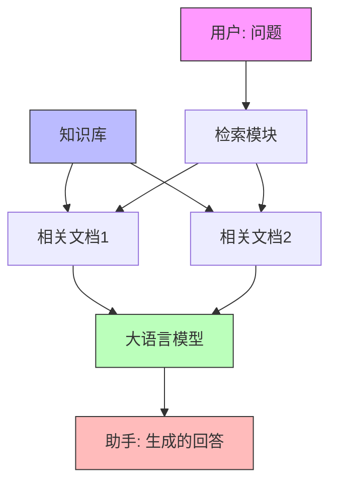

### 1. 定义
RAG 是 Retrieval-Augmented Generation 的缩写，中文翻译为"检索增强生成"。它是一种将检索系统和生成式 AI 模型结合的技术方案，主要包含两个核心步骤：

1. 检索（Retrieval）：根据用户输入的问题，从知识库中检索出相关的文档或信息片段
2. 生成（Generation）：将检索到的相关信息作为上下文，结合用户问题，让大语言模型生成准确的回答

这种方案既能让模型基于最新的知识作答，又可以提供可溯源的参考依据，有效解决了大语言模型的知识时效性和事实准确性问题。

### 1.2 为什么需要RAG

让我们对比三种问答方案的优缺点，来理解为什么 RAG 是一个更好的选择：

1. 传统检索式问答 (Retrieval QA)

    - ✅ 可靠性高：答案直接来自知识库，有明确的来源
    - ✅ 知识可更新：添加新文档即可更新知识
    - ❌ 灵活性差：只能返回知识库中已有的内容
    - ❌ 表达生硬：难以用自然语言组织答案
2. 纯 LLM 问答
    
    - ✅ 表达自然：能用流畅的语言组织答案
    - ✅ 灵活理解：可以理解各种表达方式的问题
    - ❌ 知识固化：知识仅限于训练数据，无法及时更新
    - ❌ 可靠性差：容易产生幻觉，难以验证答案准确性
3. RAG 方案
    
    - ✅ 可靠且可溯源：答案基于检索到的具体文档
    - ✅ 知识可更新：可以持续添加新的知识
    - ✅ 表达自然：利用 LLM 的语言能力组织答案
    - ✅ 灵活理解：能理解各种形式的问题
    - ✅ 成本可控：主要消耗在必要的 API 调用上

RAG 通过将检索和生成相结合，既保留了传统检索问答的可靠性，又获得了 LLM 的灵活性和自然表达能力。它能让 AI 始终基于最新的、可信的知识来回答问题，同时保持对话的流畅自然。

RAG 的典型应用场景

- 企业知识库问答：帮助企业构建对内员工知识库或对外客户问答系统。
- 法律法规、论文等参考场景：需要给出权威来源或证据的回答。
- 任何需要"带有引用信息"的回答场景。
