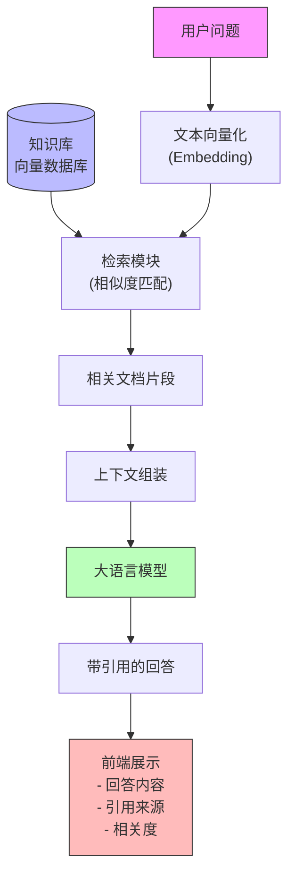

### 1.1 核心组件

- 向量数据库：用来存储文档分块后的向量（如 ChromaDB、Qdrant）。
- Embedding（文本向量化）：将文本转化为可比较的数值向量，形如 `[0.1, 0.2, 0.3, 0.4, 0.5]`
- 检索 (Retrieval)：根据用户查询的向量相似度，检索出最相关的文档切片。
- 大语言模型：将检索到的上下文与用户问题组合，再由模型 (LLM) 生成最终答案。
- 生成 (Generation) 与引用：如何在回答中嵌入引用链接或标注，方便用户溯源。

### 1.2 RAG 的典型工作流

1. 用户输入问题。
2. 将问题向量化，然后检索最相似的文档切片。
3. 将检索到的上下文与问题拼接后输入 LLM。
4. LLM 输出带引用信息的回答。
5. 前端渲染回答、可选地在可视化界面中展示引用详情。

下面用一张图展示各个组件的交互流程：

### 3. 构建知识库：文档处理、嵌入、存储