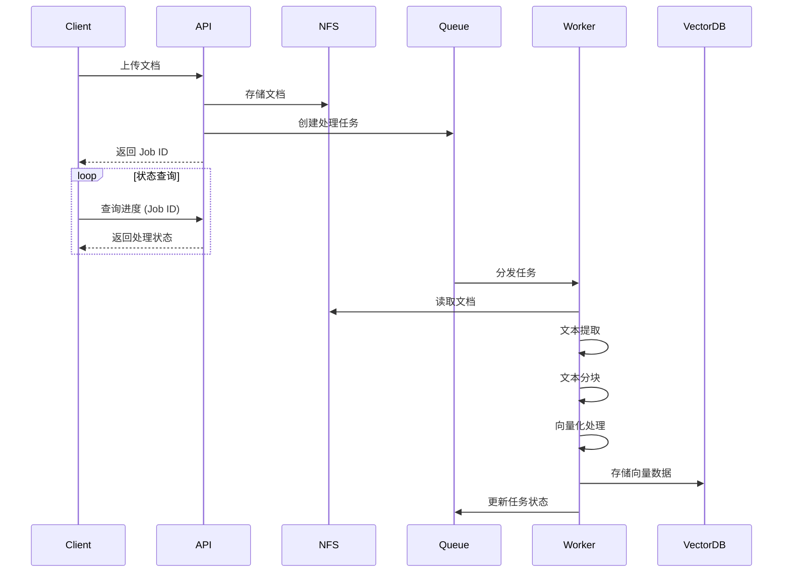
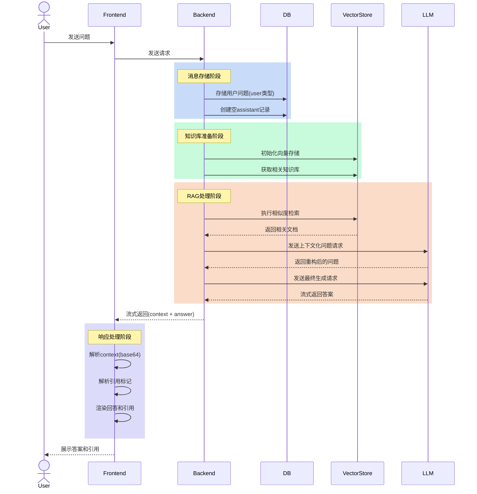
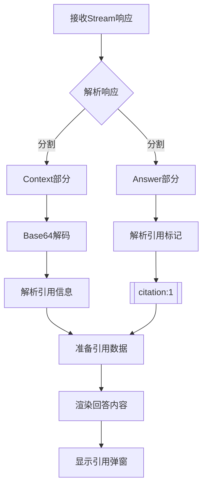

理论的事情，相信大家都了解了，相信大家也看过不少的文章，但是可能没有真正动手实践过，或者项目太复杂无从下手，或是没有一个完整的项目可以参考。

在工程的实践中，去掉那些花里胡哨的东西， 直接上代码，直接上手实践，才是这个项目的意义所在。

这个项目中，用的都是目前最为流行的技术栈， 例如：

- 前端：React（Nextjs） + TailwindCSS + AI SDK
- 后端：FastAPI + LangChain + ChromaDB/Qdrant + MySQL + MinIO
- 部署：Docker + Docker Compose

让我们通过一个完整的工程实现示例，来理解 RAG 在知识库问答中的具体应用流程。我们将按照数据流的顺序，逐步解析关键代码的实现。

### 5.1 文档上传 → 异步处理

详细代码可以参考： `backend/app/services/document_processor.py`


从上面的系统架构图中可以看到，文档上传和处理的流程如下：

1. 用户上传文档 (PDF/MD/TXT/DOCX)
    
    - 客户端发起文档上传请求
    - 文档被临时存储到 NFS (Network File System)
    - 系统生成并返回一个 Job ID 给客户端
2. 异步处理流程启动
    
    - 文档预处理：提取文本、清洗数据
    - 文本分块：按照设定的策略进行分段
    - 向量化：通过 Embedding 服务将文本转换为向量
    - 存储：将向量数据保存到向量数据库
3. 状态查询
    
    - 客户端通过 Job ID 轮询任务状态
    - 系统返回当前进度 (Processing/Completed/Failed)

这种异步处理的设计有以下优点：

- 支持大文件处理：不会因处理时间过长导致请求超时
- 提升用户体验：用户可以实时查看处理进度
- 系统解耦：文档处理与存储服务可以独立扩展
- 错误处理：失败任务可以重试，不影响其他上传

在代码实现中，主要涉及以下几个关键组件：

1. 文件上传接口
2. 任务队列系统
3. 异步处理服务
4. 状态查询接口

这种设计让整个文档处理流程更加健壮和可扩展。

>在文档处理流程中，我们特别注意了一个容易被忽视的细节：在更新文档时，许多系统会采用“先删后增”的策略，即先从存储系统中删除旧文档，再插入新文档。然而，这种方式在使用向量数据库进行检索增强（RAG）时会带来严重的问题 —— 删除操作会导致原有的向量索引失效，从而在新文档尚未建模完成前，系统处于**信息缺失**状态，影响检索结果的准确性与稳定性。
>
>为了解决这一问题，我们采用了**延迟删除机制**：通过引入一个临时表（或中间缓存表）存储新文档数据，待向量化和索引构建完成并验证成功后，才安全地移除旧文档。这一策略有效避免了索引“空窗期”，确保了系统在文档更新过程中的连续性与一致性。

### 5.2 用户提问 → 检索 + LLM 生成
代码可查阅： `backend/app/services/chat_service.py`

从前端使用 AI SDK 发送到后台，后台接口接收后会进行，用户 Query 的处理流程如下:

1. **消息存储**
    
    - 将用户的提问内容保存为 user 类型的消息记录
    - 创建一个空的 assistant 类型消息记录作为占位符
2. **知识库准备**
    
    - 根据传入的 knowledge_base_ids 获取相关知识库
    - 初始化 OpenAI Embeddings
    - 为每个知识库创建对应的向量存储 (Vector Store)
3. **检索增强生成 (RAG) 处理**
    
    - 使用向量存储创建检索器 (Retriever)
    - 构建两个关键提示词模板:
        - `contextualize_q_prompt`: 用于理解聊天历史上下文,重新构造独立的问题
        - `qa_prompt`: 用于生成最终答案,包含引用格式要求和语言适配等规则
4. **响应生成**
    
    - 处理历史聊天记录,构建对话上下文
    - 使用流式响应逐步生成内容
    - 响应内容包含两部分:
        - 相关文档上下文 (base64 编码)
        - LLM 生成的回答内容
5. **结果处理**
    
    - 实时返回生成的内容片段
    - 更新数据库中的 assistant 消息记录
    - 完整响应格式: `{context_base64}__LLM_RESPONSE__{answer}`
6. **异常处理**
    
    - 捕获并记录生成过程中的错误
    - 更新错误信息到消息记录
    - 确保数据库会话正确关闭

前端接收到后台返回的 stream 返回以后，可开始解析这个 stream 后， 除了正常和其他 QA 聊天工具一样， 这里还多了一个引用信息， 所以需要解析出引用信息， 然后展示在页面上。

他是怎么运作的呢？这里前端会通过 `__LLM_RESPONSE__` 这个分隔符来解析, 前面一部分是 RAG 检索出来的 context 信息（base64 编码， 可以理解为是检索出来的切片的数组），后面是 LLM 按照 context 回来的信息， 然后通过 `[[citation:1]]` 这个格式来解析出引用信息。

代码可查询：

- Chat 页面：`frontend/src/app/dashboard/chat/[id]/page.tsx`
- 引用信息展示：`frontend/src/components/chat/answer.tsx`

```
const CitationLink = useMemo(

() =>

(

props: ClassAttributes<HTMLAnchorElement> &

AnchorHTMLAttributes<HTMLAnchorElement>

) => {

const citationId = props.href?.match(/^(\d+)$/)?.[1];

const citation = citationId

? citations[parseInt(citationId) - 1]

: null;

if (!citation) {

return <a>[{props.href}]</a>;

}

const citationInfo =

citationInfoMap[

`${citation.metadata.kb_id}-${citation.metadata.document_id}`

];

return (

<Popover>

<PopoverTrigger asChild>

<a

{...props}

href="#"

role="button"

className="inline-flex items-center gap-1 px-1.5 py-0.5 text-xs font-medium text-blue-600 bg-blue-50 rounded hover:bg-blue-100 transition-colors relative"

>

<span className="absolute -top-3 -right-1">[{props.href}]</span>

</a>

</PopoverTrigger>

<PopoverContent

side="top"

align="start"

className="max-w-2xl w-[calc(100vw-100px)] p-4 rounded-lg shadow-lg"

>

<div className="text-sm space-y-3">

{citationInfo && (

<div className="flex items-center gap-2 text-xs font-medium text-gray-700 bg-gray-50 p-2 rounded">

<div className="w-5 h-5 flex items-center justify-center">

<FileIcon

extension={

citationInfo.document.file_name.split(".").pop() || ""

}

color="#E2E8F0"

labelColor="#94A3B8"

/>

</div>

<span className="truncate">

{citationInfo.knowledge_base.name} /{" "}

{citationInfo.document.file_name}

</span>

</div>

)}

<Divider />

<p className="text-gray-700 leading-relaxed">{citation.text}</p>

<Divider />

{Object.keys(citation.metadata).length > 0 && (

<div className="text-xs text-gray-500 bg-gray-50 p-2 rounded">

<div className="font-medium mb-2">Debug Info:</div>

<div className="space-y-1">

{Object.entries(citation.metadata).map(([key, value]) => (

<div key={key} className="flex">

<span className="font-medium min-w-[100px]">

{key}:

</span>

<span className="text-gray-600">{String(value)}</span>

</div>

))}

</div>

</div>

)}

</div>

</PopoverContent>

</Popover>

);

},

[citations, citationInfoMap]

);
```
当用户点击引用信息的时候， 会弹出一个弹窗， 展示引用详情， 包括知识库名称， 文件名称， 以及引用内容。