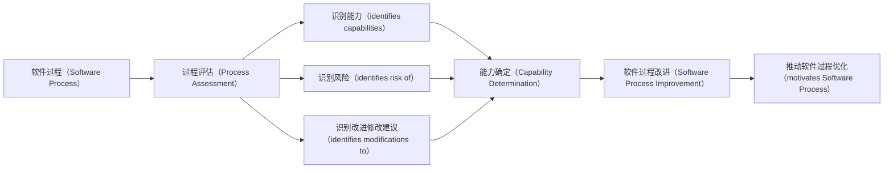

# 第 3 章 软件过程结构（Ch.3 Software Process Structure）

## 3.1 通用过程模型（A Generic Process Model）

### 1. 软件过程框架构成

软件过程框架（Software Process – framework）由**框架活动（Framework Activities）**、**任务集（Task Set）**、**具体行动（Action）** 和**伞形活动（Umbrella Activities）** 组成，层级结构如下：
#### 伞形活动
- **定义**：贯穿整个软件开发生命周期的支持性活动
    
- **特点**：
    
    - 不属于某个具体阶段，但影响所有阶段
        
    - 主要用于保证软件质量和管理过程
        
- **示例**：
    
- **项目管理（Project Management）**：
    
    - 项目管理是伞形活动中最核心的一部分，涉及项目的规划、组织、资源分配、进度跟踪、预算管理等内容。它贯穿整个项目生命周期，确保项目按时、按质量和按预算完成。
        
- **配置管理（Configuration Management）**：
    
    - 配置管理确保软件开发过程中所有项目文件（包括源代码、文档、配置文件等）的版本控制和一致性。它避免了不同版本间的混淆，保证了不同开发阶段的可追溯性和一致性。
        
- **质量保证（Quality Assurance）**：
    
    - 质量保证活动确保软件在整个开发周期内始终符合质量标准。这包括代码审查、自动化测试、缺陷管理等，以提高软件的稳定性、性能和安全性。质量保证不仅仅是测试，更多的是贯穿开发的每个环节，持续提高产品质量。
        
- **风险管理（Risk Management）**：
    
    - 风险管理在项目初期识别潜在的风险因素，并通过计划、监控和应对措施来控制这些风险的影响。风险管理贯穿项目生命周期，在项目执行过程中持续评估和调整，确保项目目标不会因风险而受阻
#### 框架活动（Framework Activities）

- **定义**：软件开发中主要的高层次活动，是开发过程的骨架
    
- **常见框架活动**：
    
    1. 沟通（Communication / Requirement Gathering）
        
    2. 规划（Planning）
        
    3. 建模（Modeling / Analysis & Design）
        
    4. 构建（Construction / Implementation & Testing）
        
    5. 部署（Deployment / Delivery & Feedback）

#### 任务集（Task Set）
- **定义**：每个框架活动可以进一步分解为多个任务集
    
- **特点**：
    
    - 任务集是**可管理、可执行的子活动**
        
    - 每个任务集可以独立计划和执行
        
- **示例**：
    
    - 在“建模”框架活动下，任务集可能包括“数据建模任务集”、“用户界面原型任务集”等
#### 行动（Action）
- **定义**：每个任务集由多个具体行动组成，是最底层的可执行步骤
    
- **特点**：
    
    - 可直接执行和衡量
        
    - 每个行动都有明确输入和输出
        
- **示例**：
    
    - “创建类图”、“编写单元测试”、“撰写用户手册”

### 2. 过程流类型（Process flow）

通用过程模型包含 5 个核心框架活动，基于活动执行顺序的不同，分为以下 4 种过程流：

  

| 过程流类型                               | 核心活动顺序与特点                                                                                                      | 应用场景 / 特点说明                                                                        |     |
| ----------------------------------- | -------------------------------------------------------------------------------------------------------------- | ---------------------------------------------------------------------------------- | --- |
| （a）线性过程流（Linear process flow）       | 按固定顺序依次执行：   1. 沟通（Communication）→ 2. 规划（Planning）→ 3. 建模（Modeling）→ 4. 构建（Construction）→ 5. 部署（Deployment） | - 又称瀑布模型（Waterfall）   - 每个阶段完成后进入下一阶段   - 优点：结构清晰、易管理   - 缺点：不适应需求频繁变化的项目 |     |
| （b）迭代过程流（Iterative process flow）    | 重复执行核心活动循环：   沟通（Communication）→ 规划（Planning）→ 建模（Modeling）→ 构建（Construction）→ 部署（Deployment）→ （回到沟通，迭代优化）  | - 强调**持续反馈和改进**   - 每轮迭代都可生成部分可用产品   - 适合需求逐渐明晰的项目                           |     |
| （c）进化过程流（Evolutionary process flow） | 分阶段迭代并发布增量成果：   每次循环执行 “沟通→规划→建模→构建→部署”，并伴随 “增量发布（Increment released）”，逐步完善软件                               | - 又称增量开发（Incremental Development）   - 软件逐步演化，可让客户尽早使用部分功能   - 风险较低，可快速响应市场变化 |     |
| （d）并行过程流（Parallel process flow）     | 核心活动部分并行执行：   沟通、规划、建模、构建、部署等活动可根据需求同步推进（如建模与规划并行、构建与部分部署准备并行），时间（Time）维度上存在活动重叠                            | - 适用于大型项目或团队分工明确的情况   - 可加快开发速度，但需严格管理依赖关系   - 并行活动之间需要协调，防止冲突               |     |

## 3.4 过程模式（Process Patterns）

### 1. 过程模式定义
- **概念**：过程模式是一种 **可重用的、标准化的经验模板**，用于指导软件过程中特定场景的活动和行为。
- **核心内容**：过程模式不仅描述 **做什么（活动、任务、行动）**，还包括 **输出（工作产品）** 和 **执行规则**。
    
- **作用**：
    1. 提供开发团队可复用的最佳实践
    2. 减少经验不足带来的风险
    3. 支持过程改进和过程标准化

> 简单理解：过程模式就像“软件开发的操作指南”，告诉你在特定场景下该怎么做、产出什么、注意哪些问题。
> 
- **活动（Activities）**

    - 描述模式中应执行的主要操作或阶段
        
    - 示例：需求分析、架构设计、单元测试
        
- **行动（Actions）**
    
    - 活动的细化步骤，可直接执行
        
    - 示例：编写用例、绘制类图、编写测试用例
        
- **任务集（Task Set）**
    
    - 将行动组合成逻辑相关的可管理模块
        
    - 示例：在“构建”活动下，任务集可能包含“模块开发任务集”、“集成测试任务集”
        
- **工作产品（Work Products）**
    
    - 模式执行的产出，可供下一个活动使用
        
    - 示例：需求文档、设计图、测试报告、部署包
        
- **角色 / 责任（Roles / Responsibilities）**
    
    - 指定执行活动或行动的人员或团队
        
    - 示例：系统分析师负责需求收集，开发人员负责编码
        
- **约束 / 指导（Guidelines / Constraints）**
    
    - 指出执行过程中的注意事项或规则
        
    - 示例：必须遵守编码规范，单元测试覆盖率>80%
        
- **可复用性和适用场景（Reusability & Applicability）**
    
    - 明确模式在何种场景下适用，以及可复用程度
        
    - 示例：适用于中型 Web 系统开发，或适用于敏捷迭代开发
### 2. 通用软件模式要素（Generic software pattern elements）

| 要素名称                              | 说明                                                                                                                               |                                                                                                                                                                                           |
| --------------------------------- | -------------------------------------------------------------------------------------------------------------------------------- | ----------------------------------------------------------------------------------------------------------------------------------------------------------------------------------------- |
| 有意义的模式名称（Meaningful pattern name） | 简洁标识模式的核心用途                                                                                                                      | 用一句简洁明了的名称标识模式核心用途。例如：“需求验证模式”或“增量交付模式”。便于团队快速理解模式功能。                                                                                                                                     |
| 意图（Intent）                        | 明确模式的目标与解决的问题                                                                                                                    | 明确该模式解决的具体问题或目标。例如：减少需求误解、提升交付可预测性、保证系统质量。意图帮助团队判断是否需要应用该模式。                                                                                                                              |
| 类型（Type）                          | 分为三类：   - 任务模式（Task pattern）：定义工程行动或工作任务   - 阶段模式（Stage pattern）：定义过程中的框架活动   - 阶段序列模式（Phase pattern）：定义过程中框架活动的执行顺序与流程 |  \|模式的分类，指导应用粒度：   - **任务模式（Task pattern）**：具体行动或工作任务，如“编写单元测试”。   - **阶段模式（Stage pattern）**：定义高层框架活动，如“需求分析阶段”。   - **阶段序列模式（Phase pattern）**：定义活动的执行顺序，如“先沟通 → 再建模 → 最后部署”。 |
| 初始上下文（Initial context）            | 描述使用该模式前必须满足的前提条件                                                                                                                | 使用该模式前的前提条件或环境。例如：“用户需求已初步收集完毕”、“核心架构已设计”。确保模式应用时基础条件满足，否则效果不佳。                                                                                                                           |
| 解决方案（Solution）                    | 说明如何正确实现该模式的具体步骤                                                                                                                 | 模式的核心内容，说明如何正确实施。例如：“在需求验证模式中，先进行用例评审，再组织客户确认会议，最后更新需求文档”。                                                                                                                                |
| 结果上下文（Resulting context）          | 描述成功实现模式后达到的状态与结果                                                                                                                | 成功应用模式后产生的状态或效果。例如：“需求文档准确反映用户需求、开发团队理解一致”，或者“增量模块已部署并可使用”。                                                                                                                               |
| 相关模式（Related patterns）            | 链接与当前模式直接相关的其他模式                                                                                                                 | 与当前模式存在关联的其他模式，便于形成模式网络或组合使用。例如，“需求验证模式”可能关联“需求收集模式”和“用例建模模式”。                                                                                                                            |
| 已知应用 / 示例（Known uses/examples）    | 列举该模式适用的具体场景与实例                                                                                                                  | 提供具体案例或项目中应用的实例，帮助理解模式的实际效果。例如：“在某敏捷Web项目中使用增量交付模式，每两周发布一次可用功能模块”。                                                                                                                        |

## 3.5 过程评估（Process Assessment）

### 1. 主要评估标准

常用的软件过程评估标准包括：

  

- SCAMPI
- CBA IPI
- SPICE（ISO/IEC 15504）
- ISO 9001:2000（软件领域适用版本）

### 2. 过程评估与改进的逻辑关系

- **软件过程（Software Process）**：指软件开发和管理的整体流程，包括需求分析、设计、编码、测试等各个阶段。
    
- **过程评估（Process Assessment）**：对软件过程进行评估，识别出当前过程中的能力、潜在风险以及改进的建议。
    
    - **识别能力（identifies capabilities）**：评估当前过程的优势和能有效达成目标的能力。
        
    - **识别风险（identifies risk of）**：识别在当前过程中可能存在的风险或薄弱环节，可能导致问题的因素。
        
    - **识别改进修改建议（identifies modifications to）**：根据评估结果，提出优化和改进过程的建议。
        
- **能力确定（Capability Determination）**：评估过程中，对现有能力进行确定，以明确其强项和弱项，识别哪些方面能够被提升。
    
- **软件过程改进（Software Process Improvement）**：基于评估结果，提出具体的改进措施，推动软件过程优化。
    
- **推动软件过程优化（motivates Software Process）**：通过改进推动软件过程的持续优化，使其更加高效、符合需求和提高质量。

## 能力成熟度模型集成（The Capability Maturity Model Integration）

该模型由卡内基梅隆大学（CMU）的软件工程研究所（SEI）提出，将软件过程成熟度分为 5 个等级（含 1 个未完成等级），具体定义如下：

  

| 成熟度等级   | 等级名称                         | 核心特征                                            | 核心特征与解读                                                  |
| ------- | ---------------------------- | ----------------------------------------------- | -------------------------------------------------------- |
| Level 0 | 未完成（Incomplete）              | 过程未执行，或未达到该等级定义的所有目标                            | - 基本没有规范化过程   - 依赖个人能力，缺乏可重复性   - 高风险、高不确定性        |
| Level 1 | 已执行（Performed）               | 能够完成生产所需工作产品的必要工作任务                             | - 过程开始实施   - 可以完成核心工作，但依赖个人经验   - 过程不稳定，重复性差       |
| Level 2 | 已管理（Managed）                 | 工作人员可获取充足资源；利益相关方积极参与；工作任务与产品通过监控、审查和评估确保符合过程描述 | - 引入管理控制和项目计划   - 关注资源、时间和任务分配   - 过程可重复，能够满足项目需求  |
| Level 3 | 已定义（Defined）                 | 管理和工程过程已文档化、标准化，并集成到组织级软件过程中                    | - 建立组织级标准流程   - 各项目遵循统一过程指南   - 便于培训新员工和跨团队协作      |
| Level 4 | 定量管理（Quantitatively Managed） | 通过详细度量，对软件过程和产品形成定量理解与控制                        | - 引入**量化指标和数据分析**   - 可预测过程性能和产品质量   - 支持科学决策和风险控制 |
| Level 5 | 优化中（Optimizing）              | 借助过程的定量反馈和创新理念测试，实现过程的持续改进                      | - 持续改进和创新流程   - 通过反馈循环优化效率和质量   - 支持组织竞争力提升        |
