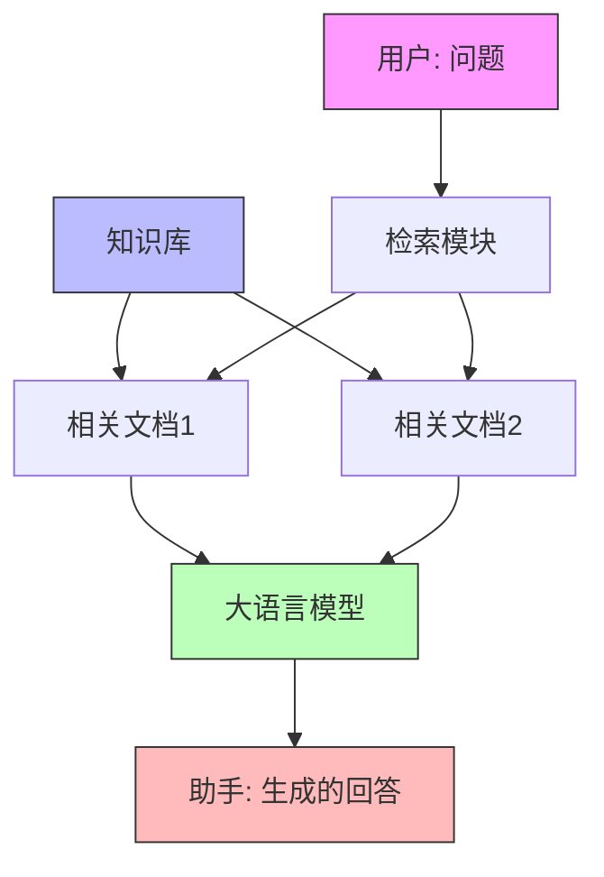

RAG 是 Retrieval-Augmented Generation 的缩写，中文翻译为"检索增强生成"。它是一种将检索系统和生成式 AI 模型结合的技术方案，主要包含两个核心步骤：

1. 检索（Retrieval）：根据用户输入的问题，从知识库中检索出相关的文档或信息片段
2. 生成（Generation）：将检索到的相关信息作为上下文，结合用户问题，让大语言模型生成准确的回答

这种方案既能让模型基于最新的知识作答，又可以提供可溯源的参考依据，有效解决了大语言模型的知识时效性和事实准确性问题。

